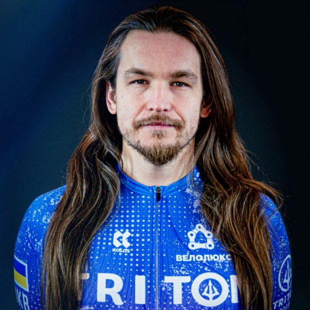

# About Me

<!--suppress CheckImageSize -->

## Сізов Олександр

Викладач курсу

---

- Більше 10 років у комерційній розробці.
- Більше 8 років співпрацюю з курсами. Як спікер, лектор, ментор тощо.
- Близько 7 років співпрацював над платформою на тему кібербезпеки.
- Працював з Python і не тільки. Також особливо подобається Rust.
- Займаюся аматорським тріатлоном (плавання, біг, велоспорт).
